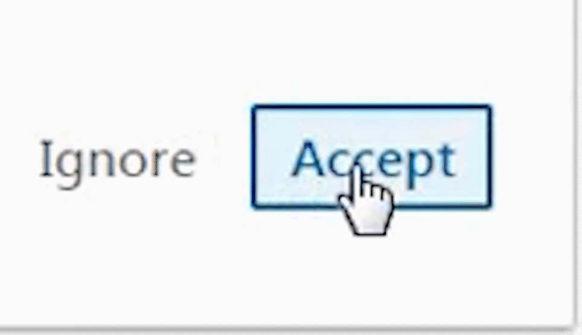

# Auto Accept Connections: Linkedin Feature✅

### *This project allows you to accept all your Linkedin connection requests in a single click.*

 

### Steps to run this project:
**Step 1**: Run the below commands to install dependencies: 
  <code>pip install streamlit 
  pip install selenium</code>
  
**Step 2**: Change the path of Chrome Driver according to the location of file in line 14 of *app.py* 
 
 <code>driver = webdriver.Chrome(executable_path=r"C:\Users\HP\Desktop\Projects\Auto-Accept\chromedriver.exe")</code>
  
*Change the path in executable path depending on the location of your project.*
  
**Step 3**: Run the project by the below command:  
  <code>streamlit run app.py</code>
  
  ***Enter login credentials and you are good to go!***
